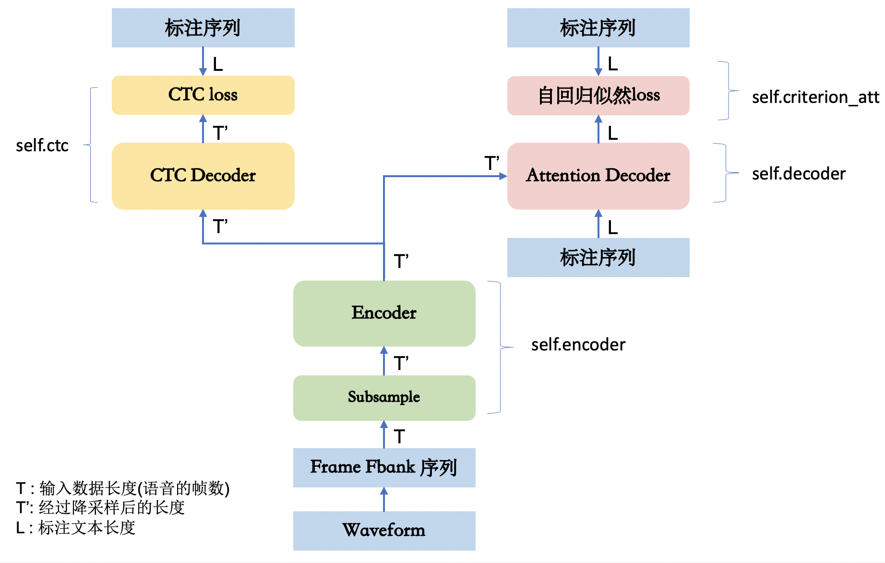
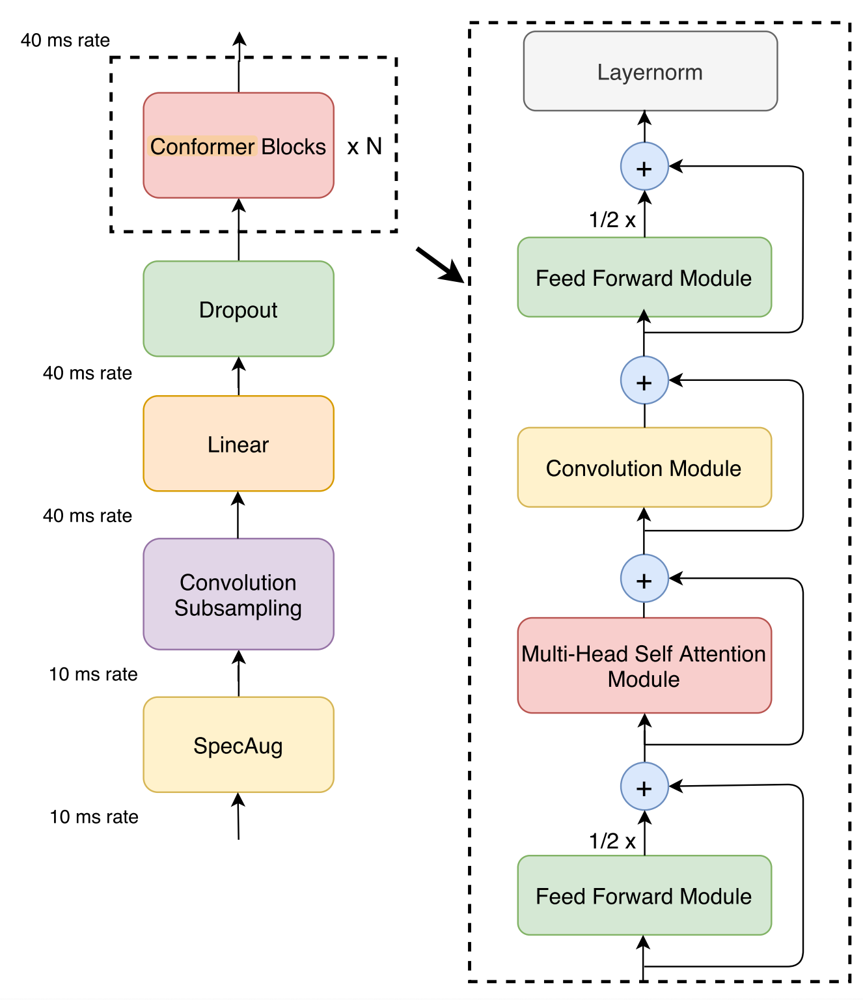
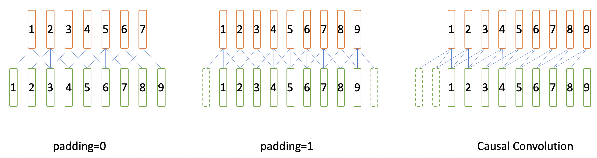
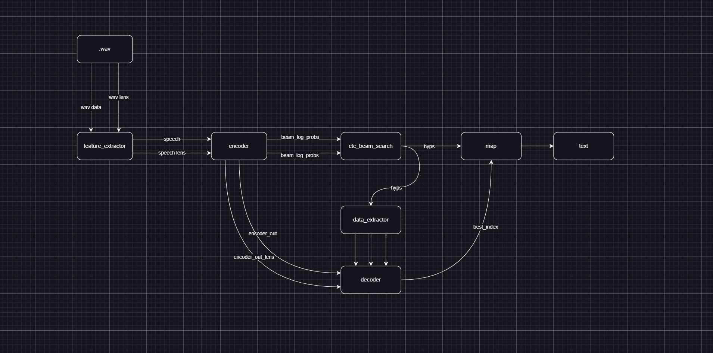

# wenet原理

### 训练整体结构




### Encoder

#### SubSampling

1.输入序列越长，即帧的个数越多，网络计算量就越大。而在语音识别中，一定时间范围内的语音信号是相似的，多个连续帧对应的是同一个发音，另外，端到端语音识别使用建模单元一般是一个时间延续较长的单元（粗粒度），比如建模单元是一个中文汉字，假如一个汉字用时0.2s，0.2s对应20帧，如果将20帧的信息进行合并，比如合并为5帧，在进行帧同步输出时不会出现丢字问题，同时还可以线性的减少后续encoder网络的前向计算、CTC loss和AED计算cross attention时的开销。

2.将Fbank特征长度为F, 原始Fbank特征数为T，送入下采样卷积模块中，输入shape（1，1，T，F）

3.下采样卷积模块由两个Conv2D（kernel_num=odim，k=3, s=2）组成，下采样4倍。
```
class Conv2dSubsampling4(BaseSubsampling):
    def __init__(self, idim: int, odim: int, dropout_rate: float,
                 pos_enc_class: torch.nn.Module):
        """Construct an Conv2dSubsampling4 object."""
        super().__init__()
        self.conv = torch.nn.Sequential(
            torch.nn.Conv2d(1, odim, 3, 2),
            torch.nn.ReLU(),
            torch.nn.Conv2d(odim, odim, 3, 2),
            torch.nn.ReLU(),
        )
        self.out = torch.nn.Linear(odim * (((idim - 1) // 2 - 1) // 2), odim)
        self.pos_enc = pos_enc_class
        # The right context for every conv layer is computed by:
        # (kernel_size - 1) / 2 * stride  * frame_rate_of_this_layer
        self.subsampling_rate = 4
        # 6 = (3 - 1) / 2 * 2 * 1 + (3 - 1) / 2 * 2 * 2
        self.right_context = 6

    def forward(...):
    x = x.unsqueeze(1)  # (b, c=1, t, f)
    x = self.conv(x)
    b, c, t, f = x.size()
    x = self.out(x.transpose(1, 2).contiguous().view(b, t, c * f))
    x, pos_emb = self.pos_enc(x, offset)
    return x, pos_emb, x_mask[:, :, :-2:2][:, :, :-2:2]
```

4.经过下采样卷积后，特征图通道不再是1，输出通道定义为odim，则下采样模块输出shape为（1，odim，T/4，F/4），通过transpose将shape改为（1，T/4，odim，F/4）后再reshape成（1，T/4，odim*F/4），最后将次特征图送到linear做affine变换。

5.需要注意两个变量：
```
subsampling_rate: 对于相邻两个解码帧，在原始帧上的间隔。

right_context: 对于某个解码帧，其对应的第一个原始帧的右侧还需要额外依赖多少帧，才能获得这个解码帧的全部信息。
```
对于解码阶段，需要知道一个解码帧对应多少原语音特征帧，通过subsampling_rate以及right_context可以计算出原语音特征帧序列中的索引以及offset。

#### Encoder block (Transformer & ConFormer)
1.ConFormer在Transformer中引入卷积层，Wenet中的Encoder使用了ConformerEncoderLayer堆叠。

ConformerEncoderLayer主要由以下模块组成：

RelPositionMultiHeadedAttention

PositionwiseFeedForward

ConvolutionModule



```
class ConformerEncoderLayer(nn.Module):
    def forward(...):
        residual = x
        x = self.norm_ff_macaron(x)
        x = self.feed_forward_macaron(x)
        x = residual + 0.5 * self.dropout(x)

        residual = x
        x = self.norm_mha(x)
        x_att = self.self_attn(x, x, x, pos_emb, mask)
        x = residual + self.dropout(x_att)

        residual = x
        x = self.norm_conv(x)
        x, new_cnn_cache = self.conv_module(x, mask_pad, cnn_cache)
        x = residual + self.dropout(x)

        residual = x
        x = self.norm_ff(x)
        x = self.feed_forward(x)
        x = residual + 0.5 * self.dropout(x)

        x = self.norm_final(x)
```
可以看到，对于RelPositionMultiHeadedAttention，ConvolutionModule，PositionwiseFeedForward，都是前有Layernorm，后有Dropout，再搭配Residual。

2.RelPositionMultiHeadedAttention

原始的Conformer论文中提到的self-attention是Relative Position Multi Headed Attention，这是transformer-xl中提出的一种改进attention，和标准attention的区别在于，其中显示利用了相对位置信息，具体原理和实现可参考文章。 https://zhuanlan.zhihu.com/p/344604604

3.PositionwiseFeedForward

PositionwiseFeedForward，对各个帧时刻输入均使用同一个矩阵权重去做前向线性映射计算，即通过一个[H1, H2]的的矩阵，把[B, T, H1]变为[B，T，H2]。

4.ConvolutionModule

Wenet中使用了因果卷积(Causal Convolution)，即不看右侧上下文，这样无论模型含有多少卷积层，对右侧的上下文都无依赖。



### CTC

1.对于一个给定的输入x，它可以计算对应所有可能的y的概率分布。通过该概率分布，可以预测最大概率对应的输出或者某个特定输出的概率。

函数目标是最大化 P(y | x)

2.CTC本质上对所有合法的输出和输入对齐方式进行了穷举，所谓合法，即对齐后的输出序列能够按CTC规则规约得到的原标注序列，则为合法对齐。使用CTC目标函数会引入一个blank的输出单元，CTC规约规则为：

2.1.连续的相同字符进行合并

2.2.移除blank字符

3.举个例子：

假如当前语音Fbank帧长度为32帧，经过subsample后得到8个解码帧，将8个解码帧F送入Encode后得到8个输出帧R，此时ground truth为“我是学生”。

计算loss时，GT需要与Encoder的输出一一匹配，这里涉及的问题称之为对齐。按照CTC的约束，GT更新为：

-我-是-学-生

-我是--学-生

....

我-是-学学生生

我是是-学-生生

loss函数就是计算上面多个GT对应概率之和。求这个目标函数梯度的一种方式是穷举所有的有效CTC对齐，分别求梯度相加。但是这种方法复杂度太高。由于CTC本身结构特点，存在一种更高效的动态规划算法，可以极大的提升速度。

4.CTC decoder仅仅对Encoder做了一次前向线性计算，然后计算softmax。

### Decoder

1.提供了自回归Transformer和双向自回归Transformer结构

2.所谓自回归，既上一时刻的网络输出要作为网络当前时刻的输入，产生当前时刻的输出。

3.解码时，不需要对每一个输入帧都进行输出，而是根据整个输入序列信息和已输出信息进行下一次输出，直到输出一个特殊结束字符。 这种解码方法称为Label同步解码。

4.标准的AED中，decoder和encoder之间cross-attention需要看到encoder的完整序列，所以无法进行流式识别。

5.研究者发现，联合使用CTC loss和AED可以有效的加速训练收敛，同时得到更好的识别结果。

6.在解码时，同时使用CTC和AED的输出，可以提高识别率，但是由于AED本身是非流式的解码，在Wenet中，则没采用联合解码的方式，而是采用了先使用CTC解码，再用AED对CTC的Nbest结果进行Rescoring，这样即结合了两种模型的效果，又可以应用于流式场景。


### 推理流程



### 参考

CTC原理：https://zhuanlan.zhihu.com/p/161186907

Relative Position Multi Headed Attention原理：https://zhuanlan.zhihu.com/p/344604604